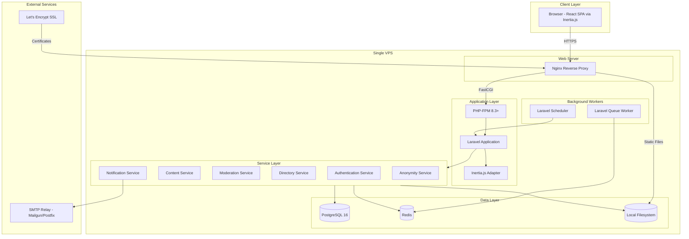
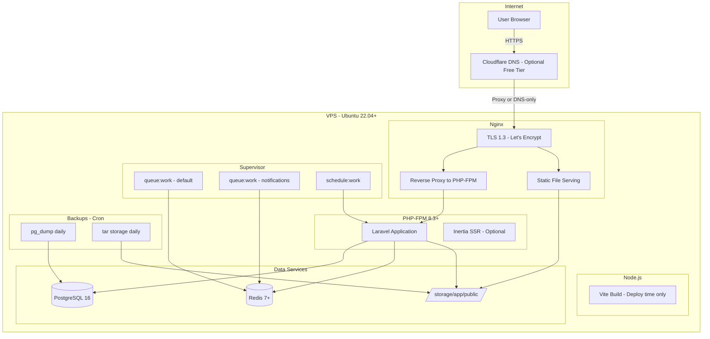
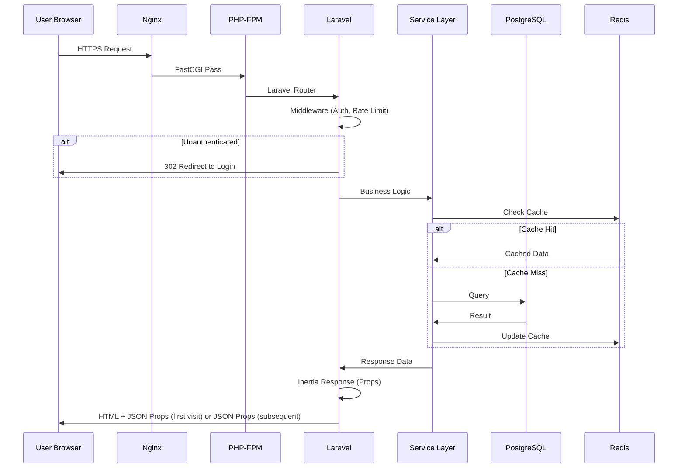
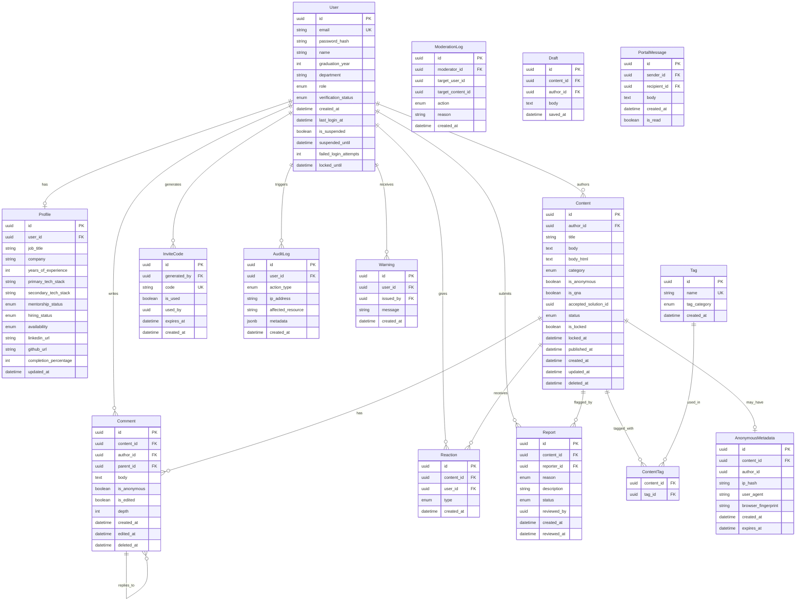

# Design Document: SIBAKA Portal

## Overview

SIBAKA (Sinau Bareng Kamisetembang) is a knowledge sharing portal for IT alumni of STM Pembangunan Semarang. The platform enables alumni to share professional experiences, discuss technical topics, build networks, and support career development within a safe, code-friendly environment.

### Key Design Goals

- **Safe anonymity**: Members can share sensitive career information without identity exposure
- **Code-friendly**: First-class support for syntax highlighting, code blocks, and technical content
- **Talent mapping**: Searchable alumni directory with filtering by expertise, batch, and availability
- **Community moderation**: Automated and manual moderation to maintain quality
- **Performance**: Sub-2-second page loads with optimistic UI updates
- **Simple deployment**: Single VPS with straightforward ops, no cloud vendor lock-in

### Technology Stack

| Layer | Technology | Rationale |
|-------|-----------|-----------|
| Backend Framework | Laravel 11+ (PHP 8.3+) | Batteries-included: queues, scheduler, notifications, auth |
| Frontend Framework | React 18+ with Vite + TypeScript | Fast HMR, modern bundling, type safety |
| Bridge | Inertia.js | Server-side routing with client-side SPA rendering, no API duplication |
| Database | PostgreSQL 16 | Relational integrity, full-text search, JSON support |
| ORM | Eloquent (Laravel) | Active Record with migrations, relationships, scopes |
| Authentication | Laravel Sanctum | Token-based API auth + cookie-based SPA auth |
| Editor | TipTap + lowlight | Headless WYSIWYG with Markdown and code syntax highlighting |
| Styling | Tailwind CSS + shadcn/ui | Utility-first CSS with accessible component library |
| Search | PostgreSQL Full-Text Search | Sufficient for initial scale, no external dependency |
| Cache/Queue | Redis | Session, cache, rate limiting, queue driver |
| File Storage | Local filesystem (storage/app/public) | Nginx serves static files directly, no S3 needed |
| Email | SMTP relay (Mailgun/Postfix) | Laravel Notifications with mail channel |
| Testing (Backend) | Pest PHP + phpunit-quickcheck | Unit/integration with property-based testing |
| Testing (Frontend) | Vitest + fast-check | React component tests with property-based testing |
| Testing (E2E) | Playwright | Cross-browser end-to-end tests |

## Architecture

### High-Level System Architecture



### Deployment Architecture



### Request Flow



### Architectural Decisions

1. **Laravel over Next.js**: Laravel provides a complete backend ecosystem out of the box — queues, scheduler, notifications, form validation, authorization policies — reducing the need for external packages. PHP-FPM on a single VPS is simpler to operate than a Node.js deployment.

2. **Inertia.js as the bridge**: Inertia gives us server-side routing (Laravel controllers return page components with props) while keeping the client-side a React SPA. No need to build and maintain a separate REST API for frontend consumption — controllers directly pass data to React components.

3. **Single VPS over cloud**: For an alumni community portal with bounded scale (~thousands of users), a single well-configured VPS is cost-effective, simple to maintain, and avoids cloud complexity. Vertical scaling (bigger VPS) handles growth for years.

4. **PostgreSQL over NoSQL**: The relational nature of users, content, comments, reactions, and moderation logs benefits from referential integrity. Full-text search covers directory/content search needs at this scale.

5. **TipTap on the frontend**: TipTap is headless (full styling control), has first-class Markdown support via extensions, and the `CodeBlockLowlight` extension provides syntax highlighting for 190+ languages out of the box.

6. **Laravel Sanctum over JWT/OAuth**: Sanctum provides simple cookie-based session authentication for the SPA (Inertia) and token-based auth for any future mobile API. No complex token refresh flows needed.

7. **Redis for ephemeral data**: Rate limiting counters, session storage, queue jobs, cache, and auto-save drafts benefit from Redis's speed and TTL support.

8. **Local filesystem over S3**: For a single VPS deployment, local storage with Nginx serving static files is simpler and faster. Backups via cron handle durability.

9. **Soft-delete pattern**: All content deletions are soft-deletes (`deleted_at` timestamp) to support moderation audit trails and potential appeals.

## Components and Interfaces

### Module Structure

```
sibaka/
├── app/                              # Laravel Application
│   ├── Http/
│   │   ├── Controllers/
│   │   │   ├── Auth/
│   │   │   │   ├── RegisterController.php
│   │   │   │   ├── LoginController.php
│   │   │   │   ├── VerificationController.php
│   │   │   │   └── InviteCodeController.php
│   │   │   ├── ContentController.php
│   │   │   ├── CommentController.php
│   │   │   ├── ReactionController.php
│   │   │   ├── DirectoryController.php
│   │   │   ├── ProfileController.php
│   │   │   ├── DraftController.php
│   │   │   ├── MessageController.php
│   │   │   └── Moderation/
│   │   │       ├── ReportController.php
│   │   │       ├── QueueController.php
│   │   │       ├── SuspensionController.php
│   │   │       ├── WarningController.php
│   │   │       └── DashboardController.php
│   │   ├── Middleware/
│   │   │   ├── EnsureVerified.php
│   │   │   ├── EnsureNotSuspended.php
│   │   │   ├── RateLimitByIp.php
│   │   │   └── HandleInertiaRequests.php
│   │   └── Requests/                 # Form Requests (Validation)
│   │       ├── Auth/
│   │       │   ├── RegisterRequest.php
│   │       │   └── VerifyInviteRequest.php
│   │       ├── StoreContentRequest.php
│   │       ├── UpdateContentRequest.php
│   │       ├── StoreCommentRequest.php
│   │       ├── UpdateProfileRequest.php
│   │       └── ReportContentRequest.php
│   ├── Models/
│   │   ├── User.php
│   │   ├── Profile.php
│   │   ├── Content.php
│   │   ├── Comment.php
│   │   ├── Reaction.php
│   │   ├── Tag.php
│   │   ├── ContentTag.php
│   │   ├── InviteCode.php
│   │   ├── Report.php
│   │   ├── Warning.php
│   │   ├── AuditLog.php
│   │   ├── ModerationLog.php
│   │   ├── AnonymousMetadata.php
│   │   ├── Draft.php
│   │   └── PortalMessage.php
│   ├── Services/
│   │   ├── AuthService.php
│   │   ├── ContentService.php
│   │   ├── AnonymityService.php
│   │   ├── ModerationService.php
│   │   ├── DirectoryService.php
│   │   ├── ReactionService.php
│   │   ├── CommentService.php
│   │   └── TagService.php
│   ├── Policies/
│   │   ├── ContentPolicy.php
│   │   ├── CommentPolicy.php
│   │   └── ModerationPolicy.php
│   ├── Jobs/
│   │   ├── PurgeAnonymousMetadata.php
│   │   ├── AutoLockThreads.php
│   │   ├── AutoFlagContent.php
│   │   └── SendNotification.php
│   ├── Notifications/
│   │   ├── VerificationApproved.php
│   │   ├── VerificationRejected.php
│   │   ├── AccountSuspended.php
│   │   ├── AccountLocked.php
│   │   └── ContentFlagged.php
│   └── Enums/
│       ├── UserRole.php
│       ├── VerificationStatus.php
│       ├── ContentCategory.php
│       ├── ContentStatus.php
│       ├── ReactionType.php
│       ├── TagCategory.php
│       ├── ReportReason.php
│       └── ModerationAction.php
├── database/
│   ├── migrations/
│   ├── seeders/
│   └── factories/
├── routes/
│   ├── web.php                       # Inertia page routes
│   ├── api.php                       # API v1 routes (if needed)
│   └── console.php                   # Scheduled commands
├── resources/
│   └── js/                           # React Frontend (Vite)
│       ├── app.tsx                    # Inertia app bootstrap
│       ├── Pages/
│       │   ├── Auth/
│       │   │   ├── Login.tsx
│       │   │   ├── Register.tsx
│       │   │   └── VerifyPending.tsx
│       │   ├── Content/
│       │   │   ├── Index.tsx
│       │   │   ├── Show.tsx
│       │   │   ├── Create.tsx
│       │   │   └── Edit.tsx
│       │   ├── Directory/
│       │   │   └── Index.tsx
│       │   ├── Profile/
│       │   │   └── Edit.tsx
│       │   └── Moderation/
│       │       ├── Dashboard.tsx
│       │       └── Queue.tsx
│       ├── Components/
│       │   ├── Editor/
│       │   │   ├── TipTapEditor.tsx
│       │   │   ├── CodeBlock.tsx
│       │   │   └── EmbedNode.tsx
│       │   ├── Content/
│       │   │   ├── ContentCard.tsx
│       │   │   ├── CategoryBadge.tsx
│       │   │   └── ReactionBar.tsx
│       │   ├── Comments/
│       │   │   ├── ThreadedComments.tsx
│       │   │   └── CommentForm.tsx
│       │   └── UI/                   # shadcn/ui components
│       ├── Hooks/
│       │   ├── useAutoSave.ts
│       │   ├── useDarkMode.ts
│       │   └── useOptimisticReaction.ts
│       ├── Layouts/
│       │   ├── AppLayout.tsx
│       │   └── AuthLayout.tsx
│       └── types/
│           └── index.d.ts
├── config/
├── storage/
│   └── app/public/                   # User uploads served by Nginx
├── tests/
│   ├── Unit/                         # Pest PHP unit tests
│   ├── Feature/                      # Pest PHP integration tests
│   ├── Property/                     # Property-based tests (phpunit-quickcheck)
│   └── js/                           # Vitest + fast-check frontend tests
└── vite.config.ts
```

### Core Service Interfaces

```php
<?php

// Authentication & Registration Service
interface AuthServiceInterface
{
    public function register(array $data): User;
    public function verifyWithInviteCode(string $userId, string $code): void;
    public function requestAdminVerification(string $userId): void;
    public function approveVerification(string $userId, string $moderatorId): void;
    public function rejectVerification(string $userId, string $reason): void;
    public function generateInviteCode(string $memberId): InviteCode;
    public function lockAccount(string $userId): void;
    public function unlockAccount(string $userId): void;
    public function handleFailedLogin(string $userId): void;
}

// Content Service
interface ContentServiceInterface
{
    public function createContent(array $data, string $authorId): Content;
    public function updateContent(string $id, array $data, string $authorId): Content;
    public function publishContent(string $id, string $authorId): Content;
    public function deleteContent(string $id, string $actorId, ?string $reason = null): void;
    public function saveDraft(string $id, string $body): void;
    public function restoreDraft(string $id): ?string;
    public function getContent(string $id, ?string $viewerId = null): ?array;
    public function listContent(array $filters, int $page = 1, int $perPage = 20): LengthAwarePaginator;
}

// Anonymity Service
interface AnonymityServiceInterface
{
    public function publishAnonymously(string $contentId, string $authorId, array $metadata): void;
    public function canPublishAnonymously(string $authorId): bool;
    public function getAuthorForModeration(string $contentId, string $moderatorId): string;
    public function purgeExpiredMetadata(): int;
}

// Moderation Service
interface ModerationServiceInterface
{
    public function reportContent(string $contentId, string $reporterId, string $reason, ?string $description = null): void;
    public function reviewFlag(string $flagId, string $moderatorId, string $action): void;
    public function suspendUser(string $userId, int $days, string $reason, string $moderatorId): void;
    public function issueWarning(string $userId, string $message, string $moderatorId): void;
    public function checkAutoFlag(string $content): array;
    public function getDashboardStats(): array;
    public function getModerationQueue(array $filters, int $page = 1): LengthAwarePaginator;
}

// Directory Service
interface DirectoryServiceInterface
{
    public function searchAlumni(string $query, array $filters, int $page = 1): LengthAwarePaginator;
    public function getAlumniProfile(string $userId): ?array;
    public function updateProfile(string $userId, array $data): Profile;
    public function getProfileCompletion(string $userId): array;
}

// Reaction Service
interface ReactionServiceInterface
{
    public function react(string $contentId, string $userId, string $type): void;
    public function removeReaction(string $contentId, string $userId): void;
    public function changeReaction(string $contentId, string $userId, string $newType): void;
    public function getReactionSummary(string $contentId): array;
}

// Comment Service
interface CommentServiceInterface
{
    public function addComment(string $contentId, string $authorId, array $data): Comment;
    public function editComment(string $commentId, string $authorId, string $text): Comment;
    public function deleteComment(string $commentId, string $authorId): void;
    public function markAcceptedSolution(string $commentId, string $contentAuthorId): void;
    public function unmarkAcceptedSolution(string $commentId, string $contentAuthorId): void;
    public function getThreadedComments(string $contentId): array;
}
```

### Validation Layer (Laravel Form Requests)

```php
<?php

namespace App\Http\Requests\Auth;

use Illuminate\Foundation\Http\FormRequest;

// Registration validation (Requirement 1.2)
class RegisterRequest extends FormRequest
{
    public function rules(): array
    {
        return [
            'name' => ['required', 'string', 'min:1', 'max:100'],
            'email' => ['required', 'email', 'unique:users,email'],
            'password' => ['required', 'string', 'min:8'],
            'graduation_year' => ['required', 'integer', 'min:1979', 'max:' . date('Y')],
            'department' => ['required', 'string', 'min:1', 'max:100'],
            'linkedin_url' => ['nullable', 'url', 'max:200'],
            'github_url' => ['nullable', 'url', 'max:200'],
        ];
    }
}

// Profile validation (Requirement 2.3, 2.4)
class UpdateProfileRequest extends FormRequest
{
    public function rules(): array
    {
        return [
            'job_title' => ['required', 'string', 'min:1', 'max:100'],
            'company' => ['required', 'string', 'min:1', 'max:100'],
            'years_of_experience' => ['required', 'integer', 'min:0', 'max:50'],
            'primary_tech_stack' => ['required', 'string', 'min:1', 'max:200'],
            'secondary_tech_stack' => ['nullable', 'string', 'max:200'],
            'mentorship_status' => ['nullable', 'in:willing,not_willing'],
            'hiring_status' => ['nullable', 'in:open_to_hiring,seeking_job,internship,none'],
            'availability' => ['nullable', 'in:immediate,1_month,2_months,3_months_plus'],
        ];
    }
}

// Content validation (Requirements 3, 4, 6)
class StoreContentRequest extends FormRequest
{
    public function rules(): array
    {
        return [
            'title' => ['required', 'string', 'min:1', 'max:200'],
            'body' => ['required', 'string', 'min:1', 'max:50000'],
            'category' => ['required', 'in:post_mortem,tech_stack,career_interview,showcase'],
            'is_anonymous' => ['boolean'],
            'is_qna' => ['boolean'],
            'tags.tech_stack' => ['required', 'array', 'min:1', 'max:3'],
            'tags.tech_stack.*' => ['required', 'string', 'exists:tags,name'],
            'tags.experience_level' => ['required', 'in:beginner,intermediate,advanced,architecture'],
            'tags.category' => ['required', 'in:incident,architecture,career,project'],
            'embeds' => ['nullable', 'array', 'max:10'],
            'embeds.*' => ['url'],
        ];
    }
}

// Comment validation (Requirement 7.7)
class StoreCommentRequest extends FormRequest
{
    public function rules(): array
    {
        return [
            'text' => ['required', 'string', 'min:1', 'max:5000'],
            'parent_id' => ['nullable', 'uuid', 'exists:comments,id'],
            'is_anonymous' => ['boolean'],
        ];
    }

    protected function prepareForValidation(): void
    {
        $this->merge([
            'text' => trim($this->text ?? ''),
        ]);
    }
}

// Report content (Requirement 12.8)
class ReportContentRequest extends FormRequest
{
    public function rules(): array
    {
        return [
            'reason' => ['required', 'in:spam,harassment,misinformation,off_topic,other'],
            'description' => ['nullable', 'string', 'max:500'],
        ];
    }
}
```

### API Routes (Laravel Convention)

#### Authentication & Registration

| Endpoint | Method | Controller | Description | Auth |
|----------|--------|------------|-------------|------|
| `/api/v1/auth/register` | POST | `RegisterController@store` | Register new user | Public |
| `/api/v1/auth/login` | POST | `LoginController@store` | Login | Public |
| `/api/v1/auth/logout` | POST | `LoginController@destroy` | Logout | Auth |
| `/api/v1/auth/verify-invite` | POST | `VerificationController@verifyInvite` | Verify invite code | Pending |
| `/api/v1/invite-codes` | POST | `InviteCodeController@store` | Generate invite code | Member |

#### Content (RESTful Resource)

| Endpoint | Method | Controller | Description | Auth |
|----------|--------|------------|-------------|------|
| `/api/v1/content` | GET | `ContentController@index` | List content with filters | Public (limited) |
| `/api/v1/content` | POST | `ContentController@store` | Create/publish content | Member |
| `/api/v1/content/{content}` | GET | `ContentController@show` | Get content by ID | Public (limited) |
| `/api/v1/content/{content}` | PUT | `ContentController@update` | Update content | Author |
| `/api/v1/content/{content}` | DELETE | `ContentController@destroy` | Soft-delete content | Author/Moderator |
| `/api/v1/content/{content}/draft` | PUT | `DraftController@update` | Auto-save draft | Member |
| `/api/v1/content/{content}/draft` | GET | `DraftController@show` | Restore draft | Member |

#### Comments & Reactions

| Endpoint | Method | Controller | Description | Auth |
|----------|--------|------------|-------------|------|
| `/api/v1/content/{content}/comments` | GET | `CommentController@index` | Get threaded comments | Public |
| `/api/v1/content/{content}/comments` | POST | `CommentController@store` | Add comment | Member |
| `/api/v1/comments/{comment}` | PUT | `CommentController@update` | Edit comment | Author (15min) |
| `/api/v1/comments/{comment}` | DELETE | `CommentController@destroy` | Delete comment | Author |
| `/api/v1/comments/{comment}/accept` | POST | `CommentController@accept` | Mark accepted solution | Content Author |
| `/api/v1/comments/{comment}/accept` | DELETE | `CommentController@unaccept` | Unmark solution | Content Author |
| `/api/v1/content/{content}/reactions` | POST | `ReactionController@store` | Add/change reaction | Member |
| `/api/v1/content/{content}/reactions` | DELETE | `ReactionController@destroy` | Remove reaction | Member |

#### Directory & Profile

| Endpoint | Method | Controller | Description | Auth |
|----------|--------|------------|-------------|------|
| `/api/v1/directory` | GET | `DirectoryController@index` | Search alumni directory | Member |
| `/api/v1/directory/{user}` | GET | `DirectoryController@show` | Get alumni profile | Member |
| `/api/v1/profile` | GET | `ProfileController@show` | Get own profile | Member |
| `/api/v1/profile` | PUT | `ProfileController@update` | Update profile | Member |
| `/api/v1/messages` | POST | `MessageController@store` | Send portal message | Member |

#### Moderation

| Endpoint | Method | Controller | Description | Auth |
|----------|--------|------------|-------------|------|
| `/api/v1/moderation/reports` | POST | `ReportController@store` | Report content | Member |
| `/api/v1/moderation/queue` | GET | `QueueController@index` | Get moderation queue | Moderator |
| `/api/v1/moderation/flags/{report}` | POST | `QueueController@review` | Review flagged content | Moderator |
| `/api/v1/moderation/suspend` | POST | `SuspensionController@store` | Suspend user | Moderator |
| `/api/v1/moderation/warn` | POST | `WarningController@store` | Issue warning | Moderator |
| `/api/v1/moderation/dashboard` | GET | `DashboardController@index` | Dashboard stats | Moderator |

## Data Models

### Entity Relationship Diagram



### Laravel Migrations (Key Models)

```php
<?php

// database/migrations/xxxx_create_users_table.php
use Illuminate\Database\Migrations\Migration;
use Illuminate\Database\Schema\Blueprint;
use Illuminate\Support\Facades\Schema;

return new class extends Migration
{
    public function up(): void
    {
        Schema::create('users', function (Blueprint $table) {
            $table->uuid('id')->primary();
            $table->string('email')->unique();
            $table->string('password');
            $table->string('name', 100);
            $table->integer('graduation_year');
            $table->string('department', 100);
            $table->string('role')->default('pending'); // guest, pending, member, moderator, admin
            $table->string('verification_status')->default('pending'); // pending, approved, rejected
            $table->integer('failed_login_attempts')->default(0);
            $table->timestamp('locked_until')->nullable();
            $table->boolean('is_suspended')->default(false);
            $table->timestamp('suspended_until')->nullable();
            $table->timestamp('last_login_at')->nullable();
            $table->timestamps();

            $table->index('graduation_year');
            $table->index('role');
        });
    }
};

// database/migrations/xxxx_create_profiles_table.php
return new class extends Migration
{
    public function up(): void
    {
        Schema::create('profiles', function (Blueprint $table) {
            $table->uuid('id')->primary();
            $table->foreignUuid('user_id')->constrained()->cascadeOnDelete();
            $table->string('job_title', 100)->nullable();
            $table->string('company', 100)->nullable();
            $table->integer('years_of_experience')->nullable();
            $table->string('primary_tech_stack', 200)->nullable();
            $table->string('secondary_tech_stack', 200)->nullable();
            $table->string('mentorship_status')->nullable(); // willing, not_willing
            $table->string('hiring_status')->nullable(); // open_to_hiring, seeking_job, internship, none
            $table->string('availability')->nullable(); // immediate, 1_month, 2_months, 3_months_plus
            $table->string('linkedin_url', 200)->nullable();
            $table->string('github_url', 200)->nullable();
            $table->integer('completion_percentage')->default(0);
            $table->timestamps();

            $table->unique('user_id');
        });
    }
};

// database/migrations/xxxx_create_contents_table.php
return new class extends Migration
{
    public function up(): void
    {
        Schema::create('contents', function (Blueprint $table) {
            $table->uuid('id')->primary();
            $table->foreignUuid('author_id')->constrained('users');
            $table->string('title', 200);
            $table->text('body');
            $table->text('body_html');
            $table->string('category'); // post_mortem, tech_stack, career_interview, showcase
            $table->boolean('is_anonymous')->default(false);
            $table->boolean('is_qna')->default(false);
            $table->uuid('accepted_solution_id')->nullable();
            $table->string('status')->default('draft'); // draft, published, hidden, deleted
            $table->boolean('is_locked')->default(false);
            $table->timestamp('locked_at')->nullable();
            $table->timestamp('published_at')->nullable();
            $table->timestamps();
            $table->softDeletes();

            $table->index('author_id');
            $table->index('category');
            $table->index('status');
            $table->index('published_at');
            $table->index('is_locked');
        });
    }
};

// database/migrations/xxxx_create_reactions_table.php
return new class extends Migration
{
    public function up(): void
    {
        Schema::create('reactions', function (Blueprint $table) {
            $table->uuid('id')->primary();
            $table->foreignUuid('content_id')->constrained('contents')->cascadeOnDelete();
            $table->foreignUuid('user_id')->constrained('users')->cascadeOnDelete();
            $table->string('type'); // insightful, relatable, helpful, solutif
            $table->timestamps();

            $table->unique(['content_id', 'user_id']);
            $table->index('content_id');
        });
    }
};

// database/migrations/xxxx_create_comments_table.php
return new class extends Migration
{
    public function up(): void
    {
        Schema::create('comments', function (Blueprint $table) {
            $table->uuid('id')->primary();
            $table->foreignUuid('content_id')->constrained('contents')->cascadeOnDelete();
            $table->foreignUuid('author_id')->constrained('users');
            $table->uuid('parent_id')->nullable();
            $table->text('body');
            $table->boolean('is_anonymous')->default(false);
            $table->boolean('is_edited')->default(false);
            $table->integer('depth')->default(0);
            $table->timestamp('edited_at')->nullable();
            $table->timestamps();
            $table->softDeletes();

            $table->foreign('parent_id')->references('id')->on('comments');
            $table->index(['content_id', 'depth']);
        });
    }
};
```


```php
<?php

// database/migrations/xxxx_create_anonymous_metadata_table.php
return new class extends Migration
{
    public function up(): void
    {
        Schema::create('anonymous_metadata', function (Blueprint $table) {
            $table->uuid('id')->primary();
            $table->foreignUuid('content_id')->constrained('contents')->cascadeOnDelete();
            $table->uuid('author_id');
            $table->string('ip_hash');
            $table->text('user_agent');
            $table->string('browser_fingerprint');
            $table->timestamp('expires_at');
            $table->timestamps();

            $table->index('expires_at');
            $table->unique('content_id');
        });
    }
};

// database/migrations/xxxx_create_tags_table.php
return new class extends Migration
{
    public function up(): void
    {
        Schema::create('tags', function (Blueprint $table) {
            $table->uuid('id')->primary();
            $table->string('name')->unique();
            $table->string('tag_category'); // tech_stack, experience_level, content_category
            $table->timestamps();
        });

        Schema::create('content_tag', function (Blueprint $table) {
            $table->foreignUuid('content_id')->constrained('contents')->cascadeOnDelete();
            $table->foreignUuid('tag_id')->constrained('tags')->cascadeOnDelete();
            $table->primary(['content_id', 'tag_id']);
        });
    }
};

// database/migrations/xxxx_create_invite_codes_table.php
return new class extends Migration
{
    public function up(): void
    {
        Schema::create('invite_codes', function (Blueprint $table) {
            $table->uuid('id')->primary();
            $table->foreignUuid('generated_by')->constrained('users');
            $table->string('code', 32)->unique();
            $table->boolean('is_used')->default(false);
            $table->uuid('used_by')->nullable();
            $table->timestamp('expires_at');
            $table->timestamps();

            $table->foreign('used_by')->references('id')->on('users');
        });
    }
};

// database/migrations/xxxx_create_moderation_tables.php
return new class extends Migration
{
    public function up(): void
    {
        Schema::create('reports', function (Blueprint $table) {
            $table->uuid('id')->primary();
            $table->foreignUuid('content_id')->constrained('contents');
            $table->foreignUuid('reporter_id')->constrained('users');
            $table->string('reason'); // spam, harassment, misinformation, off_topic, other
            $table->string('description', 500)->nullable();
            $table->string('status')->default('pending'); // pending, reviewed, dismissed
            $table->uuid('reviewed_by')->nullable();
            $table->timestamp('reviewed_at')->nullable();
            $table->timestamps();

            $table->foreign('reviewed_by')->references('id')->on('users');
        });

        Schema::create('warnings', function (Blueprint $table) {
            $table->uuid('id')->primary();
            $table->foreignUuid('user_id')->constrained('users');
            $table->foreignUuid('issued_by')->constrained('users');
            $table->text('message');
            $table->timestamps();
        });

        Schema::create('audit_logs', function (Blueprint $table) {
            $table->uuid('id')->primary();
            $table->foreignUuid('user_id')->constrained('users');
            $table->string('action_type');
            $table->string('ip_address', 45);
            $table->string('affected_resource');
            $table->jsonb('metadata')->nullable();
            $table->timestamp('created_at');

            $table->index(['user_id', 'created_at']);
            $table->index('action_type');
        });

        Schema::create('moderation_logs', function (Blueprint $table) {
            $table->uuid('id')->primary();
            $table->foreignUuid('moderator_id')->constrained('users');
            $table->uuid('target_user_id')->nullable();
            $table->uuid('target_content_id')->nullable();
            $table->string('action'); // remove_content, suspend_user, issue_warning, dismiss
            $table->text('reason');
            $table->timestamp('created_at');

            // Immutable: no update/delete triggers at DB level
        });
    }
};

// database/migrations/xxxx_create_drafts_table.php
return new class extends Migration
{
    public function up(): void
    {
        Schema::create('drafts', function (Blueprint $table) {
            $table->uuid('id')->primary();
            $table->foreignUuid('content_id')->constrained('contents')->cascadeOnDelete();
            $table->foreignUuid('author_id')->constrained('users');
            $table->text('body');
            $table->timestamp('saved_at');

            $table->unique('content_id');
        });
    }
};

// database/migrations/xxxx_create_portal_messages_table.php
return new class extends Migration
{
    public function up(): void
    {
        Schema::create('portal_messages', function (Blueprint $table) {
            $table->uuid('id')->primary();
            $table->foreignUuid('sender_id')->constrained('users');
            $table->foreignUuid('recipient_id')->constrained('users');
            $table->text('body');
            $table->boolean('is_read')->default(false);
            $table->timestamps();

            $table->index(['recipient_id', 'is_read']);
        });
    }
};
```

### Key Data Constraints

- **One reaction per user per content**: Enforced via `unique(['content_id', 'user_id'])` on reactions table
- **Comment depth limit (5 levels)**: Enforced in application logic via `depth` field on Comment model
- **Anonymous metadata expiry (90 days)**: `expires_at` field with scheduled cleanup job (`PurgeAnonymousMetadata`)
- **Audit/moderation log immutability**: No UPDATE/DELETE permissions granted on `moderation_logs` table; PostgreSQL trigger prevents mutations
- **Thread auto-lock (90 days)**: Scheduled job (`AutoLockThreads`) checks last comment date and sets `is_locked = true`
- **Soft deletes**: Content and Comments use Laravel's `SoftDeletes` trait for audit trail preservation

## Correctness Properties

*A property is a characteristic or behavior that should hold true across all valid executions of a system — essentially, a formal statement about what the system should do. Properties serve as the bridge between human-readable specifications and machine-verifiable correctness guarantees.*

### Property 1: Registration and Profile Validation Schema Correctness

*For any* input object, the registration validator SHALL accept it if and only if: name is 1-100 chars, email is valid format, password is 8+ chars, graduation year is integer between 1979 and current year, department is 1-100 chars, and optional URLs are valid format up to 200 chars. Similarly, the profile validator SHALL accept if and only if: job title (1-100), company (1-100), years of experience (0-50 integer), and primary tech stack (1-200) are valid.

**Validates: Requirements 1.2, 2.3, 2.4**

### Property 2: Invite Code Validation

*For any* invite code submission, the system SHALL accept the code if and only if: the code exists in the database, has not been used, and has not expired. All other codes SHALL be rejected.

**Validates: Requirements 1.5**

### Property 3: Role-Based Access Control

*For any* user with a given role and any protected action, the authorization system SHALL grant access if and only if the user's role is in the action's allowed roles set. Specifically: PENDING users can only access public content; suspended users can read but not write; reaction/comment/content-creation requires MEMBER or above; moderation actions require MODERATOR or above; moderation log access requires ADMIN.

**Validates: Requirements 1.6, 8.8, 12.4, 12.5**

### Property 4: Profile Completion Percentage Calculation

*For any* combination of filled and unfilled profile fields, the completion percentage SHALL equal (filled valid fields / total fields) × 100, with the constraint that if any required field (job title, company, years of experience, primary tech stack) is unfilled, the percentage SHALL NOT exceed 50%.

**Validates: Requirements 2.7**

### Property 5: Retry Mechanism Correctness

*For any* sequence of operation attempts where the first K attempts fail and attempt K+1 succeeds (K ≤ 3), the retry mechanism SHALL attempt exactly min(K+1, 4) calls. If all 4 attempts fail, it SHALL report failure. Delays between retries SHALL follow exponential backoff (or fixed 2-second delay depending on context).

**Validates: Requirements 2.6, 3.5, 10.3**

### Property 6: Content Length and Embed Limit Validation

*For any* content submission, the validator SHALL accept if and only if the body length is between 1 and 50,000 characters inclusive, AND the number of media embeds is at most 10.

**Validates: Requirements 3.7, 3.8**

### Property 7: Content Category Validation

*For any* content submission, the validator SHALL require exactly one IT_Experience_Category. Content without a category or with multiple categories SHALL be rejected. When category filters are applied to a content listing, all returned items SHALL match at least one of the selected categories.

**Validates: Requirements 4.1, 4.6, 4.9, 4.10**

### Property 8: Anonymous Content Identity Stripping

*For any* content published with the anonymous flag set to true, the public-facing content view SHALL contain zero identifying information (no author name, no profile image URL, no member ID, no email, no contact info). The author field SHALL display "Anonymous Member" with no profile link. Multiple anonymous posts by the same author SHALL have no publicly visible correlation.

**Validates: Requirements 5.2, 5.3, 5.4, 11.3**

### Property 9: Anonymous Posting Rate Limit

*For any* member who has published N anonymous posts within the last 24 hours, a new anonymous post attempt SHALL be accepted if N < 5 and rejected if N >= 5.

**Validates: Requirements 5.9**

### Property 10: Anonymous Content Irreversibility

*For any* content that has been published with is_anonymous=true, any subsequent attempt to change is_anonymous to false SHALL be rejected, and the content SHALL remain anonymous.

**Validates: Requirements 5.7**

### Property 11: Anonymous Metadata Purge

*For any* set of anonymous metadata records, the purge function SHALL delete all records where created_at is more than 90 days ago and SHALL retain all records where created_at is 90 days or fewer ago.

**Validates: Requirements 5.6**

### Property 12: Tag Validation Rules

*For any* content submission, the tagging system SHALL accept if and only if: tech stack tags count is between 1 and 3 inclusive, exactly 1 experience level tag is selected from the predefined set, exactly 1 category tag is selected, and all tags exist in the predefined tag list. The category tag SHALL map to the content's IT_Experience_Category.

**Validates: Requirements 6.2, 6.3, 6.4, 6.6, 6.7**

### Property 13: Tag Search Prefix Matching

*For any* tag database and any search query of 2 or more characters, the returned suggestions SHALL: all be prefix matches of the query (case-insensitive), number at most 10, and be drawn only from the predefined tag list.

**Validates: Requirements 6.1**

### Property 14: Comment Thread Depth Constraint

*For any* comment tree, no comment SHALL have a depth exceeding 5. When a reply is attempted at depth 5, it SHALL be stored as a flat reply within the 5th level (depth remains 5).

**Validates: Requirements 7.1**

### Property 15: Comment Validation

*For any* string input to the comment system, after trimming leading and trailing whitespace, the comment SHALL be accepted if and only if the trimmed length is between 1 and 5,000 characters inclusive. Locked threads SHALL reject all new comment attempts regardless of content validity.

**Validates: Requirements 7.7, 7.8, 7.9**

### Property 16: Accepted Solution Uniqueness and Reputation Consistency

*For any* Q&A thread, at most one comment SHALL be marked as the accepted solution at any time. When a solution is accepted, its author gains exactly 50 reputation points. When a solution is unmarked, the author loses exactly 50 points. When the accepted solution is changed, the old author loses 50 and the new author gains 50, maintaining net conservation.

**Validates: Requirements 7.3, 7.4, 7.5**

### Property 17: Comment Edit Time Window

*For any* comment and any edit attempt, the edit SHALL be accepted if and only if the elapsed time since comment creation is less than or equal to 15 minutes. Deletion SHALL be accepted at any time by the comment author.

**Validates: Requirements 7.10**

### Property 18: Thread Auto-Lock

*For any* content thread where the most recent comment (or publication date if no comments) is more than 90 days ago, the auto-lock function SHALL set is_locked=true. Threads with more recent activity SHALL remain unlocked.

**Validates: Requirements 7.6**

### Property 19: Reaction Uniqueness and Counter Accuracy

*For any* member and any content item, at most one reaction SHALL exist at any given time. The reaction count for a content item SHALL equal the number of distinct users who currently have an active reaction on that item. Changing a reaction SHALL not change the total count but SHALL update the per-type breakdown.

**Validates: Requirements 8.1, 8.2, 8.3**

### Property 20: Reaction Threshold Badges

*For any* content item, the reaction breakdown SHALL be visible if and only if total reactions >= 50. The "Solutif Recommendation" badge SHALL be displayed if and only if the Solutif reaction count >= 10.

**Validates: Requirements 8.4, 8.5**

### Property 21: Directory Search and Filter Correctness

*For any* search query and set of filters applied to the alumni directory, all returned results SHALL match the text search (against name, job role, company, or tech stack) AND satisfy all active filter criteria (batch, job role, tech stack, experience level). Results SHALL be paginated at 20 items per page. Contact options displayed SHALL correspond exactly to the data the alumni has provided (hide missing LinkedIn/GitHub).

**Validates: Requirements 9.1, 9.2, 9.3, 9.5, 9.6**

### Property 22: Draft Round-Trip Persistence

*For any* draft content saved by a member, restoring that draft SHALL return content identical to what was last successfully saved.

**Validates: Requirements 10.4**

### Property 23: XSS Sanitization

*For any* input string, the sanitization function SHALL produce output that contains no executable script content (no `<script>` tags, no `on*` event handlers, no `javascript:` URLs). Special characters (<, >, &, ", ') SHALL be escaped. File validation SHALL accept only .md, .txt, .pdf, .png, .jpg, .jpeg, .gif files under 10MB, with a maximum of 5 files per upload.

**Validates: Requirements 11.1**

### Property 24: Rate Limiting

*For any* IP address with N requests in the current 1-minute window, the system SHALL serve requests normally if N <= 100 and SHALL present a CAPTCHA challenge if N > 100.

**Validates: Requirements 11.4**

### Property 25: Audit Log Completeness

*For any* audit log entry, the record SHALL contain all required fields: user ID, action type, timestamp, IP address, and affected resource. No field SHALL be null or empty.

**Validates: Requirements 11.6**

### Property 26: Session Expiry

*For any* session where the last activity timestamp is more than 30 minutes before the current time, the session SHALL be marked as expired and require re-authentication.

**Validates: Requirements 11.7**

### Property 27: Account Lockout

*For any* account with N consecutive failed login attempts within a 15-minute window, the account SHALL be locked if N >= 5 and SHALL remain accessible if N < 5. Locked accounts SHALL be unlocked after 30 minutes.

**Validates: Requirements 11.8**

### Property 28: Moderation Priority Queue Ordering

*For any* set of flagged content items, the moderation queue SHALL order items such that content with 3 or more reports appears before content with fewer than 3 reports. Within each priority tier, items SHALL be ordered by most recent report timestamp.

**Validates: Requirements 12.1**

### Property 29: Auto-Flagging Pattern Detection

*For any* content text, the auto-flag system SHALL flag it if and only if it contains at least one match against the predefined pattern list (swear words, spam patterns, malicious links). Content without any pattern matches SHALL not be auto-flagged.

**Validates: Requirements 12.6**

### Property 30: Warning Escalation

*For any* member with N active warnings within the past 90 days, a new warning SHALL trigger automatic 7-day suspension if N+1 >= 3. Members with fewer than 3 warnings (including the new one) within 90 days SHALL not be auto-suspended.

**Validates: Requirements 12.7**

## Error Handling

### Laravel Exception Handler Pattern

Laravel's exception handler (`app/Exceptions/Handler.php`) provides centralized error handling. Business logic uses custom exceptions that map to appropriate HTTP responses.

```php
<?php

namespace App\Exceptions;

use Illuminate\Foundation\Exceptions\Handler as ExceptionHandler;
use Illuminate\Auth\AuthenticationException;
use Illuminate\Validation\ValidationException;
use Symfony\Component\HttpKernel\Exception\HttpException;
use Inertia\Inertia;
use Throwable;

class Handler extends ExceptionHandler
{
    protected $dontFlash = [
        'password',
        'password_confirmation',
    ];

    public function render($request, Throwable $e)
    {
        // For Inertia requests, render error pages as Inertia components
        if ($request->header('X-Inertia')) {
            if ($e instanceof ValidationException) {
                // Laravel handles this automatically via Inertia
                return parent::render($request, $e);
            }

            if ($e instanceof AuthenticationException) {
                return redirect()->route('login');
            }

            if ($e instanceof HttpException) {
                return Inertia::render('Error', [
                    'status' => $e->getStatusCode(),
                    'message' => $e->getMessage(),
                ])->toResponse($request)->setStatusCode($e->getStatusCode());
            }
        }

        return parent::render($request, $e);
    }
}

// Custom Business Exceptions
namespace App\Exceptions;

class ContentException extends \RuntimeException
{
    public static function locked(): self
    {
        return new self('Thread locked due to inactivity', 403);
    }

    public static function embedLimitReached(): self
    {
        return new self('Maximum embed limit of 10 reached', 422);
    }

    public static function characterLimitExceeded(): self
    {
        return new self('Content exceeds maximum 50,000 characters', 422);
    }
}

class AnonymityException extends \RuntimeException
{
    public static function rateLimitReached(): self
    {
        return new self('Anonymous posting limit reached (5 per 24 hours)', 429);
    }

    public static function cannotRevealIdentity(): self
    {
        return new self('Anonymous content cannot be converted to non-anonymous', 403);
    }
}

class ModerationException extends \RuntimeException
{
    public static function userSuspended(string $until): self
    {
        return new self("Account suspended until {$until}", 403);
    }

    public static function accountLocked(): self
    {
        return new self('Account locked due to failed login attempts', 423);
    }
}
```

### Error Categories and Responses

| Category | HTTP Status | Client Behavior | Example |
|----------|-------------|-----------------|---------|
| Validation | 422 | Show field errors inline (Inertia shared errors) | Invalid email format |
| Authentication | 401 | Redirect to login | Expired session |
| Authorization | 403 | Show access denied message | Pending user accessing member feature |
| Not Found | 404 | Show "not found" page | Deleted content |
| Conflict | 409 | Show specific conflict message | Duplicate email registration |
| Rate Limited | 429 | Show CAPTCHA or wait message | Exceeded request limit |
| Server Error | 500 | Show generic error, log details | Database connection failure |

### Retry Strategy

- **Auto-save failures**: 3 retries with 2-second fixed delay (frontend JavaScript)
- **Profile save failures**: 3 retries with exponential backoff (1s, 2s, 4s) (frontend)
- **Reaction operations**: Optimistic UI with revert on failure (no retry)
- **Email notifications**: 3 retries via Laravel Queue with 30-second delay, failed jobs table on final failure
- **Queue jobs**: Laravel's built-in retry with backoff (`$tries = 3`, `$backoff = [30, 60, 120]`)

### Graceful Degradation

- **Redis unavailable**: Fall back to database-backed sessions and file cache driver
- **Filesystem full**: Disable media upload, return 507 with friendly message
- **Email service down**: Queue notifications for later delivery via failed jobs retry, show in-app notification
- **Search index stale**: Serve potentially stale results with "results may be delayed" indicator

## Testing Strategy

### Dual Testing Approach

The SIBAKA Portal uses a complementary testing strategy combining example-based unit tests for specific scenarios and property-based tests for universal correctness guarantees.

### Property-Based Testing

**Backend Library**: [phpunit-quickcheck](https://github.com/steos/php-quickcheck) with Pest PHP datasets for property-style testing

**Frontend Library**: [fast-check](https://github.com/dubzzz/fast-check) for TypeScript/React component tests

**Configuration**:
- Minimum 100 iterations per property test
- Each property test references its design document property number
- Tag format: `Feature: sibaka-portal, Property {number}: {property_text}`

**Properties to implement** (from Correctness Properties section):
- Property 1: Schema validation correctness (registration + profile) — Backend: Pest + datasets
- Property 2: Invite code validation — Backend: Pest
- Property 3: Role-based access control matrix — Backend: Pest + datasets
- Property 4: Profile completion percentage calculation — Backend: Pest + phpunit-quickcheck
- Property 5: Retry mechanism behavior — Frontend: Vitest + fast-check
- Property 6: Content length and embed limits — Backend: Pest + datasets
- Property 7: Category validation and filtering — Backend: Pest
- Property 8: Anonymous identity stripping — Backend: Pest + phpunit-quickcheck
- Property 9: Anonymous rate limiting — Backend: Pest
- Property 10: Anonymous irreversibility — Backend: Pest
- Property 11: Metadata purge (time-based) — Backend: Pest + phpunit-quickcheck
- Property 12: Tag validation rules — Backend: Pest + datasets
- Property 13: Tag search prefix matching — Backend: Pest + phpunit-quickcheck
- Property 14: Comment depth constraint — Backend: Pest + phpunit-quickcheck
- Property 15: Comment validation (length + lock) — Backend: Pest + datasets
- Property 16: Accepted solution uniqueness + reputation — Backend: Pest
- Property 17: Comment edit time window — Backend: Pest + phpunit-quickcheck
- Property 18: Thread auto-lock — Backend: Pest + phpunit-quickcheck
- Property 19: Reaction uniqueness and counter accuracy — Backend: Pest + phpunit-quickcheck
- Property 20: Reaction threshold badges — Backend: Pest + phpunit-quickcheck
- Property 21: Directory search/filter correctness — Backend: Pest + phpunit-quickcheck
- Property 22: Draft round-trip persistence — Frontend: Vitest + fast-check
- Property 23: XSS sanitization — Backend: Pest + phpunit-quickcheck, Frontend: Vitest + fast-check
- Property 24: Rate limiting — Backend: Pest
- Property 25: Audit log completeness — Backend: Pest + phpunit-quickcheck
- Property 26: Session expiry — Backend: Pest
- Property 27: Account lockout — Backend: Pest + phpunit-quickcheck
- Property 28: Moderation queue ordering — Backend: Pest + phpunit-quickcheck
- Property 29: Auto-flagging pattern detection — Backend: Pest + phpunit-quickcheck
- Property 30: Warning escalation — Backend: Pest + phpunit-quickcheck

### Unit Tests (Example-Based)

**Backend (Pest PHP)** focus areas:
- Form Request validation rules (specific valid/invalid inputs)
- Service method behavior with concrete scenarios
- Policy/Gate authorization checks
- Eloquent model relationships and scopes
- Notification content and delivery channels
- Specific error messages for each rejection scenario

**Frontend (Vitest)** focus areas:
- React component rendering (editor loads, forms display correct fields)
- Inertia page props handling
- Dark mode toggle behavior
- Auto-save hook logic
- Optimistic UI updates for reactions

### Integration Tests

**Backend (Pest PHP Feature Tests)** focus areas:
- Full HTTP request/response cycles through controllers
- Database operations (Eloquent, cascade deletes, constraint enforcement)
- Laravel Sanctum authentication flows
- File upload to local storage and retrieval
- Queue job dispatch and execution
- Scheduled command execution (auto-lock, metadata purge)
- Email notification delivery via Laravel Notifications

### End-to-End Tests

**Library**: Playwright

Focus areas:
- Complete registration → verification → profile completion flow
- Content creation with TipTap editor → publish → view
- Anonymous posting flow
- Moderator workflow (flag → review → action)
- Directory search and filtering
- Dark mode persistence across sessions

### Test File Organization

```
tests/
├── Unit/                          # Pest PHP unit tests
│   ├── Services/
│   │   ├── AuthServiceTest.php
│   │   ├── ContentServiceTest.php
│   │   ├── AnonymityServiceTest.php
│   │   ├── ModerationServiceTest.php
│   │   └── ReactionServiceTest.php
│   ├── Models/
│   │   └── ProfileCompletionTest.php
│   └── Rules/
│       └── TagValidationTest.php
├── Feature/                       # Pest PHP integration tests
│   ├── Auth/
│   │   ├── RegistrationTest.php
│   │   ├── LoginTest.php
│   │   └── VerificationTest.php
│   ├── Content/
│   │   ├── ContentCrudTest.php
│   │   ├── DraftTest.php
│   │   └── AnonymousContentTest.php
│   ├── Comments/
│   │   └── CommentTest.php
│   ├── Moderation/
│   │   └── ModerationFlowTest.php
│   └── Directory/
│       └── DirectorySearchTest.php
├── Property/                      # Property-based tests (phpunit-quickcheck)
│   ├── ValidationPropertyTest.php
│   ├── AnonymityPropertyTest.php
│   ├── ModerationPropertyTest.php
│   ├── ReactionPropertyTest.php
│   ├── CommentPropertyTest.php
│   ├── DirectoryPropertyTest.php
│   └── SecurityPropertyTest.php
├── js/                            # Vitest + fast-check frontend tests
│   ├── components/
│   │   ├── Editor.test.tsx
│   │   ├── ReactionBar.test.tsx
│   │   └── CategoryBadge.test.tsx
│   ├── hooks/
│   │   ├── useAutoSave.test.ts
│   │   └── useOptimisticReaction.test.ts
│   └── property/
│       ├── validation.property.ts
│       ├── sanitization.property.ts
│       └── retry.property.ts
└── e2e/                           # Playwright end-to-end
    ├── auth.spec.ts
    ├── content.spec.ts
    ├── anonymous.spec.ts
    ├── moderation.spec.ts
    └── directory.spec.ts
```

## VPS Deployment Configuration

### Nginx Configuration

```nginx
# /etc/nginx/sites-available/sibaka.conf

server {
    listen 80;
    server_name sibaka.example.com;
    return 301 https://$server_name$request_uri;
}

server {
    listen 443 ssl http2;
    server_name sibaka.example.com;

    # SSL (Let's Encrypt via Certbot)
    ssl_certificate /etc/letsencrypt/live/sibaka.example.com/fullchain.pem;
    ssl_certificate_key /etc/letsencrypt/live/sibaka.example.com/privkey.pem;
    ssl_protocols TLSv1.3;
    ssl_ciphers ECDHE-ECDSA-AES128-GCM-SHA256:ECDHE-RSA-AES128-GCM-SHA256;
    ssl_prefer_server_ciphers off;
    ssl_session_cache shared:SSL:10m;
    ssl_session_timeout 1d;

    # HSTS
    add_header Strict-Transport-Security "max-age=63072000; includeSubDomains; preload" always;
    add_header X-Frame-Options "SAMEORIGIN" always;
    add_header X-Content-Type-Options "nosniff" always;
    add_header X-XSS-Protection "1; mode=block" always;

    root /var/www/sibaka/public;
    index index.php;

    # Gzip compression
    gzip on;
    gzip_types text/plain text/css application/json application/javascript text/xml application/xml text/javascript image/svg+xml;
    gzip_min_length 1024;

    # Static files (Vite build output)
    location /build/ {
        alias /var/www/sibaka/public/build/;
        expires 1y;
        add_header Cache-Control "public, immutable";
        access_log off;
    }

    # User uploads
    location /storage/ {
        alias /var/www/sibaka/storage/app/public/;
        expires 30d;
        add_header Cache-Control "public";
        access_log off;

        # Security: prevent PHP execution in uploads
        location ~* \.php$ {
            deny all;
        }
    }

    # Laravel application
    location / {
        try_files $uri $uri/ /index.php?$query_string;
    }

    location ~ \.php$ {
        fastcgi_pass unix:/run/php/php8.3-fpm.sock;
        fastcgi_param SCRIPT_FILENAME $realpath_root$fastcgi_script_name;
        include fastcgi_params;
        fastcgi_hide_header X-Powered-By;

        # Timeouts
        fastcgi_connect_timeout 60s;
        fastcgi_send_timeout 60s;
        fastcgi_read_timeout 60s;
    }

    # Deny dotfiles
    location ~ /\. {
        deny all;
        access_log off;
        log_not_found off;
    }

    # File upload limit
    client_max_body_size 50M;

    access_log /var/log/nginx/sibaka-access.log;
    error_log /var/log/nginx/sibaka-error.log;
}
```

### Supervisor Configuration

```ini
; /etc/supervisor/conf.d/sibaka.conf

[program:sibaka-queue-default]
process_name=%(program_name)s_%(process_num)02d
command=php /var/www/sibaka/artisan queue:work redis --sleep=3 --tries=3 --max-time=3600
autostart=true
autorestart=true
stopasgroup=true
killasgroup=true
user=www-data
numprocs=2
redirect_stderr=true
stdout_logfile=/var/log/supervisor/sibaka-queue-default.log
stopwaitsecs=3600

[program:sibaka-queue-notifications]
process_name=%(program_name)s_%(process_num)02d
command=php /var/www/sibaka/artisan queue:work redis --queue=notifications --sleep=3 --tries=3 --max-time=3600
autostart=true
autorestart=true
stopasgroup=true
killasgroup=true
user=www-data
numprocs=1
redirect_stderr=true
stdout_logfile=/var/log/supervisor/sibaka-queue-notifications.log
stopwaitsecs=3600

[program:sibaka-scheduler]
process_name=%(program_name)s
command=php /var/www/sibaka/artisan schedule:work
autostart=true
autorestart=true
user=www-data
redirect_stderr=true
stdout_logfile=/var/log/supervisor/sibaka-scheduler.log
```

### Environment Configuration (.env Example)

```env
# Application
APP_NAME=SIBAKA
APP_ENV=production
APP_KEY=base64:GENERATE_WITH_php_artisan_key:generate
APP_DEBUG=false
APP_URL=https://sibaka.example.com

# Database
DB_CONNECTION=pgsql
DB_HOST=127.0.0.1
DB_PORT=5432
DB_DATABASE=sibaka
DB_USERNAME=sibaka_user
DB_PASSWORD=SECURE_PASSWORD_HERE

# Redis
REDIS_HOST=127.0.0.1
REDIS_PASSWORD=null
REDIS_PORT=6379

# Cache & Session
CACHE_DRIVER=redis
SESSION_DRIVER=redis
SESSION_LIFETIME=30
QUEUE_CONNECTION=redis

# File Storage
FILESYSTEM_DISK=public

# Mail (SMTP Relay)
MAIL_MAILER=smtp
MAIL_HOST=smtp.mailgun.org
MAIL_PORT=587
MAIL_USERNAME=postmaster@sibaka.example.com
MAIL_PASSWORD=MAILGUN_SMTP_PASSWORD
MAIL_ENCRYPTION=tls
MAIL_FROM_ADDRESS=noreply@sibaka.example.com
MAIL_FROM_NAME="SIBAKA Portal"

# Sanctum
SANCTUM_STATEFUL_DOMAINS=sibaka.example.com

# Rate Limiting
RATE_LIMIT_PER_MINUTE=100

# Logging
LOG_CHANNEL=daily
LOG_LEVEL=warning
```

### Backup Script (Cron)

```bash
#!/bin/bash
# /opt/scripts/sibaka-backup.sh
# Run daily via cron: 0 2 * * * /opt/scripts/sibaka-backup.sh

BACKUP_DIR="/opt/backups/sibaka"
DATE=$(date +%Y%m%d_%H%M%S)
RETENTION_DAYS=30

mkdir -p "$BACKUP_DIR"

# PostgreSQL dump
pg_dump -U sibaka_user -h 127.0.0.1 sibaka | gzip > "$BACKUP_DIR/db_$DATE.sql.gz"

# Storage files backup
tar -czf "$BACKUP_DIR/storage_$DATE.tar.gz" -C /var/www/sibaka storage/app/public

# Clean old backups
find "$BACKUP_DIR" -type f -mtime +$RETENTION_DAYS -delete

echo "Backup completed: $DATE"
```

### Deployment Script (Laravel Envoy)

```php
// Envoy.blade.php
@servers(['production' => 'deploy@sibaka.example.com'])

@setup
    $repository = 'git@github.com:org/sibaka.git';
    $releases_dir = '/var/www/sibaka/releases';
    $app_dir = '/var/www/sibaka';
    $release = date('YmdHis');
    $new_release_dir = $releases_dir . '/' . $release;
@endsetup

@story('deploy')
    clone_repository
    run_composer
    run_npm
    update_symlinks
    run_migrations
    optimize
    reload_services
    cleanup
@endstory

@task('clone_repository')
    echo 'Cloning repository...'
    [ -d {{ $releases_dir }} ] || mkdir {{ $releases_dir }}
    git clone --depth 1 {{ $repository }} {{ $new_release_dir }}
@endtask

@task('run_composer')
    echo 'Installing composer dependencies...'
    cd {{ $new_release_dir }}
    composer install --no-interaction --prefer-dist --optimize-autoloader --no-dev
@endtask

@task('run_npm')
    echo 'Building frontend assets...'
    cd {{ $new_release_dir }}
    npm ci
    npm run build
    rm -rf node_modules
@endtask

@task('update_symlinks')
    echo 'Linking storage and .env...'
    rm -rf {{ $new_release_dir }}/storage
    ln -nfs {{ $app_dir }}/storage {{ $new_release_dir }}/storage
    ln -nfs {{ $app_dir }}/.env {{ $new_release_dir }}/.env
    ln -nfs {{ $new_release_dir }} {{ $app_dir }}/current
@endtask

@task('run_migrations')
    echo 'Running migrations...'
    cd {{ $app_dir }}/current
    php artisan migrate --force
@endtask

@task('optimize')
    echo 'Optimizing application...'
    cd {{ $app_dir }}/current
    php artisan config:cache
    php artisan route:cache
    php artisan view:cache
    php artisan event:cache
@endtask

@task('reload_services')
    echo 'Reloading services...'
    sudo systemctl reload php8.3-fpm
    sudo supervisorctl restart sibaka-queue-default:*
    sudo supervisorctl restart sibaka-queue-notifications:*
@endtask

@task('cleanup')
    echo 'Cleaning up old releases...'
    cd {{ $releases_dir }}
    ls -dt */ | tail -n +6 | xargs rm -rf
@endtask
```

### Scheduled Tasks (Laravel Scheduler)

```php
<?php

// routes/console.php
use Illuminate\Support\Facades\Schedule;

// Purge expired anonymous metadata (daily at 3 AM)
Schedule::job(new \App\Jobs\PurgeAnonymousMetadata)->dailyAt('03:00');

// Auto-lock inactive threads (daily at 4 AM)
Schedule::job(new \App\Jobs\AutoLockThreads)->dailyAt('04:00');

// Refresh moderation dashboard stats cache (every minute)
Schedule::command('moderation:refresh-stats')->everyMinute();

// Clean expired sessions (daily)
Schedule::command('session:gc')->daily();

// Prune failed jobs older than 7 days
Schedule::command('queue:prune-failed --hours=168')->daily();
```
